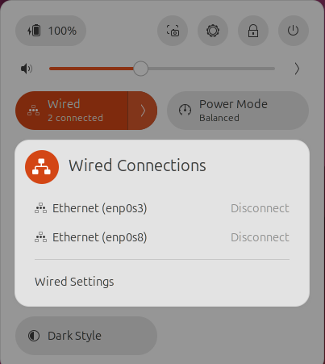
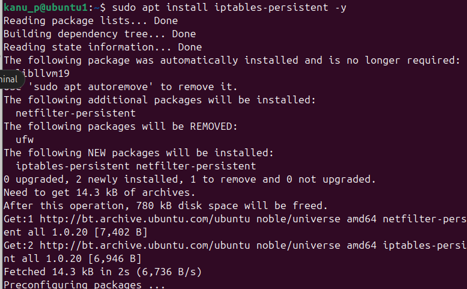
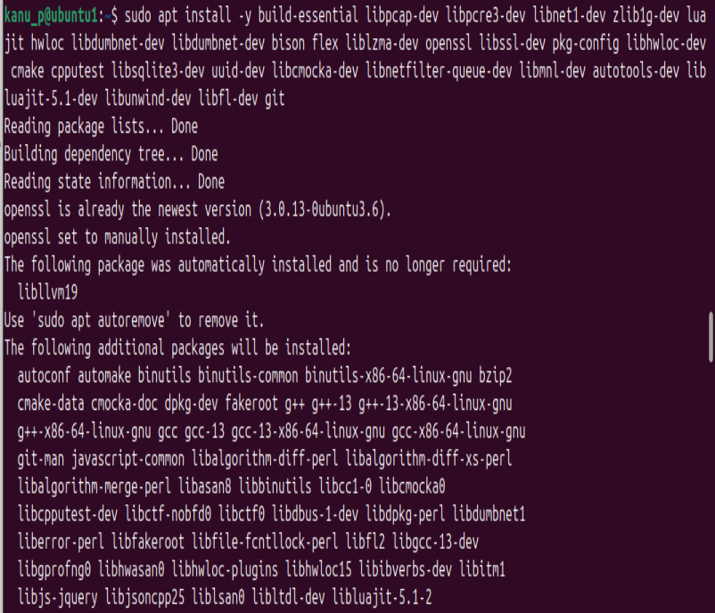

# Evaluate Firewall Rules and IDS Alerts for Simulated Attack Traffic

## Environment Setup

### Create Virtual Networks in VirtualBox

Create Host-Only Network:


#### Ubuntu VM (Victim/IDS/Firewall) 

Network Settings:

Adapter 1: Host-only Adapter → vboxnet0
Adapter 2: Internal Network → Name: intnet




Configure static IPs using Netplan

```ip a``` Verify IPs are assigned


#### Kali VM (Attacker):

Configure network (Kali uses NetworkManager):


### Install and Configure Tools on Ubuntu

Install iptables-persistent



Install Snort 3

Snort 3 requires several dependencies




