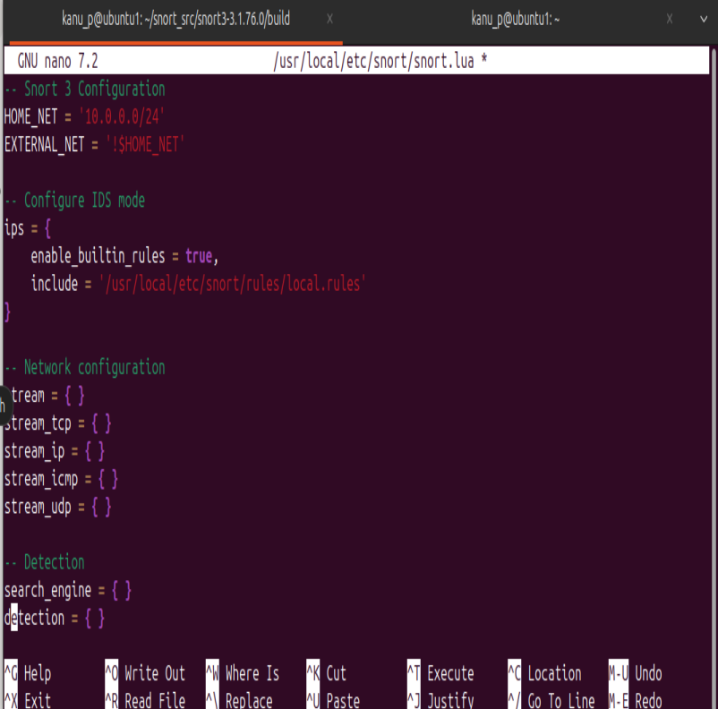
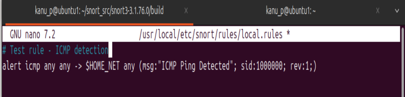
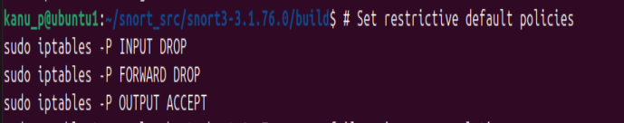
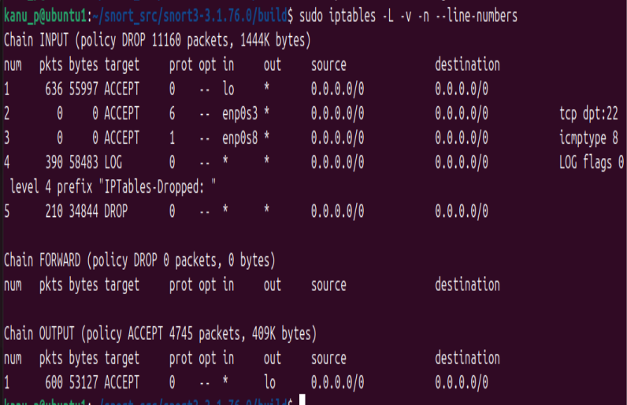
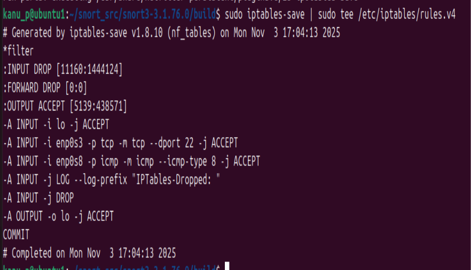
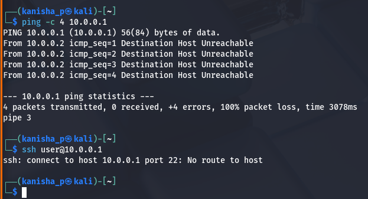
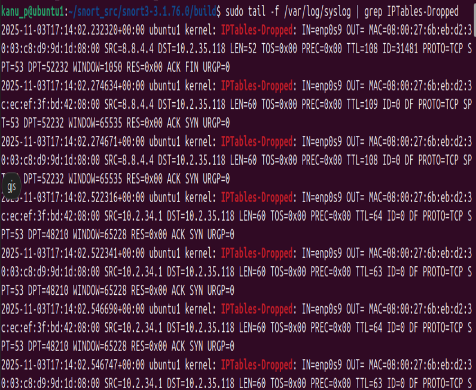
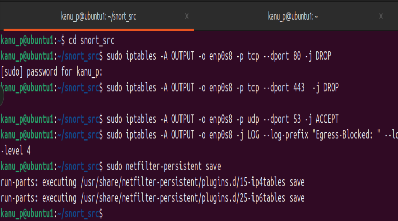

# Evaluate Firewall Rules and IDS Alerts for Simulated Attack Traffic

## Environment Setup

### Create Virtual Networks in VirtualBox

Create Host-Only Network:


#### Ubuntu VM (Victim/IDS/Firewall) 

Network Settings:

Adapter 1: Host-only Adapter → vboxnet0
Adapter 2: Internal Network → Name: intnet


Configure static IPs using Netplan

```ip a``` Verify IPs are assigned


#### Kali VM (Attacker):

Configure network (Kali uses NetworkManager):


## Install and Configure Tools on Ubuntu

Install iptables-persistent


Install Snort 3

Snort 3 requires several dependencies


Configure Snort 3

Create basic Snort configuration



Create local rules file



### Configure Baseline Firewall Rules

#### Set Default Policies



#### View and Save Rules





#### Test Firewall

From Kali VM:



check logs on ubuntu :



## Egress Busting Detection

### Restrict Egress Traffic



### Install DNS Tunneling Tool (Iodine)

On Ubuntu (IDS/Victim) and Kali(Attacker)


## Assessment Questions - Answers

1. Explain why network segmentation is important for intrusion detection.

Network segmentation divides networks into isolated zones, limiting lateral movement of attackers. It allows:

- Focused monitoring of inter-zone traffic
- Reduced attack surface
- Containment of breaches
- Tailored security policies per zone
- Easier identification of anomalous cross-zone traffic

2. What iptables rule would allow DNS but block HTTPS?

```
# Allow DNS (UDP port 53)
sudo iptables -A OUTPUT -p udp --dport 53 -j ACCEPT
```

```
# Block HTTPS (TCP port 443)
sudo iptables -A OUTPUT -p tcp --dport 443 -j DROP
```

3. Why might an attacker use port forwarding?

Attackers use port forwarding to:

- Bypass firewall restrictions
- Access internal services remotely
- Exfiltrate data through allowed channels
- Establish command & control channels
- Hide malicious traffic inside legitimate protocols

4. How does Snort detect tunneling or exfiltration?

Snort detects tunneling through:

- Pattern matching: Identifying protocol anomalies
- Volume analysis: Unusual data transfer sizes
- Frequency thresholds: High connection rates
- Port/protocol mismatches: DNS on HTTP ports
- Statistical analysis: Deviation from baseline behavior
- Signature detection: Known tunneling tool patterns

5. Suggest one method to reduce false positives in Snort rules.

Use threshold and detection filters:

```
threshold:type both, track by_src, count 10, seconds 60
```

This requires multiple occurrences before alerting, reducing noise from legitimate but unusual single events. 

Other methods include:

- Whitelist trusted IPs
- Tune content matching with depth/offset
- Use flow analysis
- Implement time-based rules
- Correlation with other events


